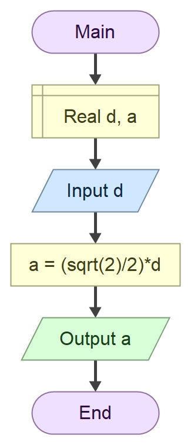

# Domaci zadatak iz tehnicke dokumentacije

## Zadatak

Program koji na osnovu unete duzine **dijagonale** kvadrata d izracunava **povrsinu** kvadrata P

## Formula 
$$
a = \frac{\sqrt{2}}{2} \cdot d
$$

### Algoritamska sema


## Resenje
``` cs
using System;

class Program
{
    static void Main()
    {
        Console.Write("Unesite duzinu dijagonale kvadrata d: ");
        double d = double.Parse(Console.ReadLine());

        double a = (Math.Sqrt(2) / 2) * d;

        double P = a * a;

        Console.WriteLine("Povrsina kvadrata iznosi: " + P);
    }
}
```

### Test primeri

Test primer 1:

``` Tekst
Unesite duzinu dijagonale kvadrata d: 10
Povrsina kvadrata iznosi: 50

C:\Users\nikic-13\source\repos\ConsoleApp9\ConsoleApp9\bin\Debug\ConsoleApp9.exe (process 4580) exited with code 0 (0x0).
Press any key to close this window . . .
```

Test primer 2:

``` Tekst
Unesite duzinu dijagonale kvadrata d: 5.7
Povrsina kvadrata iznosi: 16.245

C:\Users\nikic-13\source\repos\ConsoleApp9\ConsoleApp9\bin\Debug\ConsoleApp9.exe (process 4344) exited with code 0 (0x0).
Press any key to close this window . . .
```

### Objekti 

| Redni broj | Naziv promenljive | Tip promenljive |
| ---------- | ----------------- | --------------- |
| 1.         | `d`               | `double`        |
| 2.         | `a`               | `double`        |
| 3.         | `P`               | `double`        |


